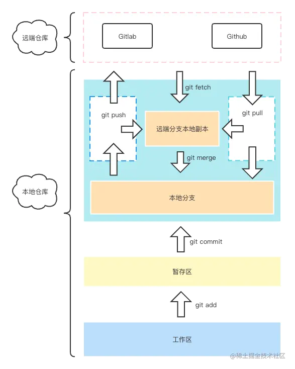

# 一、git-study
## 1.1 版本管理工具概述
github是为开发者提供git仓库托管服务的一个网站：https://github.com/
pull request是指开发者在本地对源代码进行更改后，向 GitHub 中
托管的 Git 仓库请求合并的功能。开发者可以在 Pull Request 上通过评
论交流，例如“修正了 BUG，可以合并一下吗？”以及“我试着做了这
样一个新功能，可以合并一下吗？”等。通过这个功能，开发者可以轻
松更改源代码，并公开更改的细节，然后向仓库提交合并请求。
任务管理和 BUG 报告可以通过 Issue 进行交互。
Git 属于分散型(分布式)版本管理系统，是为版本管理而设计的软件。
所谓版本管理就是管理更新的历史记录。

## 1.1 版本管理工具分类
集中型----以subversion(svn)为代表，它是集中的将所有数据存放到服务器上，优点是便于管理，其缺点是开发者所处环境不能连接网络时无法下载最新的源代码，服务器宕机也可能造成数据丢失。
分散型----以git为代表，它是将仓库fork(分支，分叉)给每一个用户，它是将原仓库复制了一份给开发者。这样每一个人都是单独的一份

# 二、Git初始化
因为Git是分布式版本控制系统，所以，每个机器都必须自报家门：
设置用户名：$ git config --global user.name "Your Name"
设置用户Email地址：$ git config --global user.email "email@example.com"
设置提高命令可读性：$ git config --global  color.ui auto
接下来就是添加一个GitHub账号
Follow（关注）别人，所 Follow 的用户的活动就会显示在您的控制面板页面
中。您可以通过这种方法知道那个人在 GitHub 上都做了些什么
Watch ()
还没有添加至 Git 仓库文件，所以显示为 Untracked files。

我是在dev分支下添加的内容，不合并分支前主分支是没有的
我是fix-b

# 三、Git工作原理
## 3.1 git 工作流
整个git工作流程如下图：

对Git各工作区域的理解：
远程仓库区：也就是我们代码最终提交的归宿，比如GitHub或者公司里自己搭建的gitlab等。
远端分支本地副本：这个其实主要储存了远程仓库各分支数据在本地的一个副本，你可以打开你 Git 项目下的 .git 文件，里面有个 refs/remotes，这里就主要存的就是远程仓库的分支信息，一般你执行 push 或者 pull、fetch 都会往这里进行更新。
本地分支：这里就是我们经常会打交道的区域，你在执行 commit 之后，本质上就是提交到了这个区域，你可以查看你的 .git 目录下的 refs/heads 目录，里面存的就是我们本地的分支代码信息。
暂存区：这个区域就是我们每次执行 git add 之后会存到的区域，用来与本地仓库之间做一个缓存，同时也是 Git 底层设计上来说也算是比较重要的一个区域，它能帮助 Git 在做 diff 的时候提高查找性能。
工作区：这个一般就是我们写代码的地方，比如你的 vscode 打开的项目，你可以进行代码编辑的地方。

日常工作中，git使用的流程大致会如下：
新员工来了，创建一个该员工的gitlab账号(以搭建gitlab为准)。
项目负责人给项目远程地址，员工自己fork一份。这是就相当于自己有了一个远程仓库，然后员工克隆自己的远程到本地。
之后就可以根据需求在不同的分支上开发即可，开发完某个功能点，我们会执行 git add 将代码提交到暂存区。，确认无误后执行 git commit 将代码提交到本地仓库。然后，本地执行 git push 将代码提交到推送到自己的远程，然后远程上发起MR也就是发起合并请求，等小组负责人审核，审核通过后合并代码。
第二天上班，员工拉起远程最新代码并合并到本地，确保本地和远程版本一致就可以开始这一天的任务了。之后就是重复这个流程。

当然，开发人员比较少时也有共用一个远程仓库的，新员工来了，建一个 员工名xxxx-dev 分支这样。然后员工克隆自己的分支到本地进行开发，之后流程也时和上面一样的。

# 四、Git常用命令
git 比较常用命令如下：当你只是一个黑奴时其实用到的命令是非常少的，但是人呢就是要有理想。
总不能一直当条咸鱼，所以大部分常用的命令都应该会。
git clone
git init
git remote
git branch
git checkout
git add
git commit
git rm
git push
git pull
git fetch
git merge
git log
git reset
git reflog
git revert
git cherry-pick
git tag
git rebase
## 4.1 常用命令及其含义
如果是按照上述git工作流介绍的情况还是自己建立远程仓库，为了把远程仓库放到本地第一个用到的命令会是
git clone xxx.git(远程仓库的地址) 
这种不带参数时默认停留在 master/main 也就是主分支上。
git clone xxx.git(远程仓库的地址) -b dev(分支名)
带 -b 参数时可以指定克隆那个分支。

而如果是现在本地创建仓库，则需要使用命令 git init 初始化所在目录为git 仓库。
之后就需要使用命令 git remote 和远程仓库进行关联。
在这之前可以使用 git remote -v 查看当前仓库有没有关联的远程库。
git remote add origin(远程仓库别名) xxx.git(远程仓库的地址)。
这个命令的作用就是添加一个远程版本库与本地仓库关联，它可以添加多个远程库。
添加之后还要使用命令 git push -u origin(远程仓库别名) master/main(本地仓库分支名)，把当前仓库的 master/main 分支和远端仓库的 master/main 分支关联起来。之后推送和拉取操作就方便了。
不想再关联远程分支时可以使用 git remote rm origin(远程仓库别名) 删除某个远程版本库与本地仓库的关联。

项目克隆到本地之后，我们知道如果是不带 -b参数的克隆默认是在主分支上。但是我们开发又一般是在开发分支develop上。
这是就需要 git branch 命令 查看或创建或删除分支有哪些分支。
git branch 即可查看当前本地仓库所有的分支信息。
git branch dev(分支名) ，创建新的分支dev。
git branch -r/--remotes 即可查看对应远程仓库的所有分支信息。
git branch -a/--all 即可查看本地和远程仓库的所有分支信息。
git branch -d/--delete dev(分支名) 删除dev分支。

在知道有那些分支之后，我们就需要切换分支了。这时候就需要使用 git checkout 命令
git checkout dev(分支名)，即可从当前分支切换到指定的dev分支上。
当然也可以使用 -b 参数直接新建并切换分支。 
git checkout -b fix ，创建一个新的分支fix并切换过去。

现在，仓库的关联，分支的查看，创建，切换，删除都有了。在分支开发代码之后，根据git工作流可以，我们需要先
把修改的代码提交暂存区，这时候使用命令git status 可以查看有哪些修改还没提交暂存区。
然后使用git add 文件名 提交文件到暂存区，常用 git add . 表示把当前目录下的所有文件改动都添加到暂存区。

文件添加到暂存区之后，我们就可以执行下一步操作了。也就是提交到本地仓库。
git commit -m/--message "提交信息"  设置本次提交的信息。

本地的修改之后，就需要先拉去远程最新的代码，防止有冲突同时也是为了和远程最新保持同步。
使用命令git fetch --all ，这个命令会拉取 git remote add 添加的所有远程关联，但是并没有和本地仓库合并。
它只是下载到远程分支的本地副本上，这是就需要合并使用命令 git merge origin/main(远程关联仓库别名)/develop，
把远程的develop分支合并到当前的本地分支，这时本地就是和远程版本同步了。

推送到自己的远程 git push ，然后发起合并请求等待审核通过就可以合并了。
如果这个分支是你本地创建的，并没有与远程分支关联(远程也没有这个分支)，那么第一次推送时就要使用下面这个命令
git push --set-upstream origin(远程分支别名) dev(本地分支同名)，即可建立和远程的关联。

